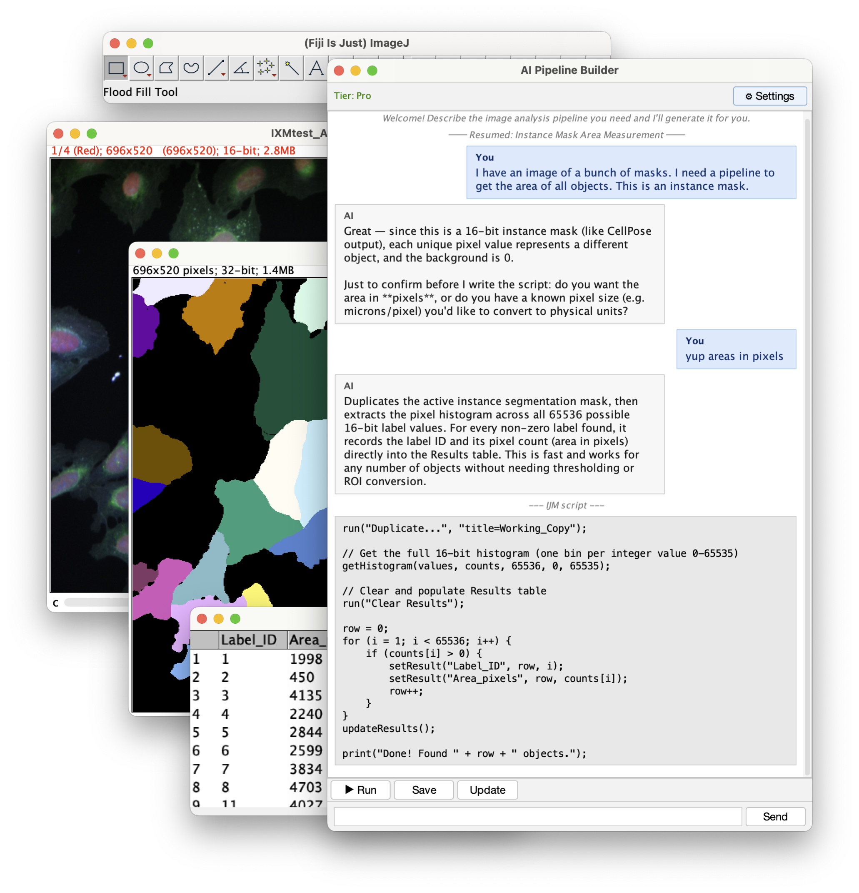

# IJPB — ImageJ Pipeline Builder

**Just tell ImageJ what you need.**

IJPB is an ImageJ/Fiji plugin that uses AI to write, run, and save image analysis pipelines from plain-English descriptions. Describe your analysis in the chat window; the AI generates an ImageJ macro or Python script, runs it on your open image, and fixes errors automatically. When you're happy, save it as a reusable menu item.

---

## Features

- **Natural language pipeline building** — describe what you need; get a working script in seconds
- **Python integration** — bridge ImageJ macros with CellPose, scikit-image, or your own models
- **Batch processing** — run any saved pipeline across entire folders with automatic export
- **Flexible AI backends** — bring your own OpenAI or Claude API key, use a local Ollama model, or subscribe to the IJPB cloud (no key needed)
- **Iterative refinement** — the AI has full context of your script; keep chatting to refine it

---

## Install

1. [**Download IJPB.jar**](https://github.com/buswinka/ijpb/releases/latest/download/ImageJPipelineBuilder.jar)
2. Open **ImageJ** or **Fiji**
3. Drag and drop `ImageJPipelineBuilder.jar` onto the ImageJ toolbar
4. **Restart ImageJ**
5. Confirm the **Pipelines** menu appears in the menu bar

---

## Quick Start

1. **Pipelines → New** to open the chat window
2. *(Optional)* Open an image you want to analyze — the AI can see open images
3. Describe your analysis in plain English, e.g.:
   - *"Count DAPI-stained nuclei and export a results table"*
   - *"Segment HeLa cells using CellPose and save masks"*
   - *"Measure mean fluorescence intensity per cell in channel 2"*
4. Hit **Run** to execute the generated script on your current image
5. Chat back and forth; the AI fixes errors automatically
6. Hit **Save** to add the pipeline to your **Pipelines** menu for one-click reuse

To edit a saved pipeline: **Pipelines → Manage**, select a pipeline, then **Edit / Resume**.

Full docs: [buswinka.github.io/ijpb/quickstart.html](https://buswinka.github.io/ijpb/quickstart.html)

---